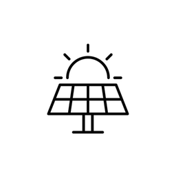

# SolarTouch — Home Assistant Integration

[](https://github.com/hacs/integration)
[](https://github.com/farhanshahlabs/ha_solarmax_onyx/releases)



Monitor your **SolarMax Onyx** solar inverter in Home Assistant. This integration connects to the **SolarTouch** cloud platform ([cloudinverter.net](https://www.cloudinverter.net)) and pulls live data every 5 minutes — no local network access required.

---

## Who is this for?

This integration is for anyone using:

- **SolarMax** inverters — the Pakistani solar brand selling the **Onyx IP65 premium inverter series**
- The **SolarTouch mobile app** (iOS / Android) to monitor their system
- The **CloudInverter.net web portal** to view solar data online
- The **SolarMax WiFi dongle** that connects the inverter to the cloud

If you log into [www.cloudinverter.net](https://www.cloudinverter.net) or the SolarTouch app to see your solar data, this integration will bring all of that data into Home Assistant automatically.

---

## Features

- **62 sensors** — full coverage of the CloudInverter Information tab: solar, battery, BMS, grid, home load, backup/EPS load, PV strings, and inverter health
- **Per-plant accuracy** — energy and power values are scoped to each individual plant, not aggregated across the whole account
- **Animated power flow card** — live diagram showing energy flow between solar panels, battery, grid, and home (requires [power-flow-card-plus](https://github.com/flixlix/power-flow-card-plus))
- **Automatic updates** every 5 minutes
- **Config flow UI** — set up via Settings → Integrations, no YAML required
- **Multiple plants** — add the integration once per plant to monitor all your sites

## Supported Hardware

| Component | Details |
|-----------|---------|
| Brand | SolarMax (Pakistan) |
| Inverter series | Onyx IP65 Premium |
| Inverter models | SM-ONYX-UL-10KW and other Onyx variants |
| Connectivity | SolarMax WiFi dongle → CloudInverter.net cloud |
| App | SolarTouch (iOS / Android) |
| Web portal | [www.cloudinverter.net](https://www.cloudinverter.net) |
| System types | Grid-tied, Off-grid, Hybrid (with battery storage) |
| Battery brands | PYLON and other BMS-compatible batteries |

> **Note:** This integration uses the same credentials as the SolarTouch app and CloudInverter.net website. If you can log in there, you can use this integration.

---

## Installation

### Via HACS (recommended)

1. In HACS, go to **Integrations → Custom repositories**
2. Add `https://github.com/farhanshahlabs/ha_solarmax_onyx` as an **Integration**
3. Search for **SolarTouch** and download it
4. Restart Home Assistant

### Manual

1. Copy the `custom_components/solarmax_onyx` folder into your HA `config/custom_components/` directory
2. Restart Home Assistant

---

## Setup

1. Go to **Settings → Devices & Services → Add Integration**
2. Search for **SolarTouch**
3. Enter your CloudInverter.net / SolarTouch app username and password
4. Select your plant (solar installation site)
5. Done — all sensors appear immediately and update every 5 minutes

To monitor multiple plants, add the integration again and select a different plant.

---

## Sensors

### Solar
| Sensor | Unit | Description |
|--------|------|-------------|
| Solar Power | W | Current AC output (per-plant) |
| Solar Energy Today | kWh | Energy generated today |
| Solar Energy Total | kWh | Lifetime energy |
| Solar Hours Total | h | Total operating hours |
| Solar Peak Power | W | Highest output ever recorded |

### PV Strings
| Sensor | Unit | Description |
|--------|------|-------------|
| PV1/2/3 Voltage | V | Per-string voltage |
| PV1/2/3 Current | A | Per-string current |
| PV1/2/3 Power | W | Per-string power |

### Grid
| Sensor | Unit | Description |
|--------|------|-------------|
| Grid Power | W | Grid import (+) / export (−) |
| Grid L1 Voltage | V | Grid line voltage |
| Grid L1 Current | A | Grid line current |
| Grid L1 Power | W | Grid line power |
| Grid Frequency | Hz | Grid frequency |
| Feed-in Energy Today | kWh | Energy exported to grid today |
| Total Feed-in Energy | kWh | Lifetime energy exported |
| Purchased Energy Today | kWh | Energy imported from grid today |
| Total Purchased Energy | kWh | Lifetime energy imported |

### Home Load
| Sensor | Unit | Description |
|--------|------|-------------|
| Home Load Power | W | Current home consumption |
| Load L1 Voltage | V | Load line voltage |
| Load L1 Current | A | Load line current |
| Load L1 Power | W | Load line power |
| Load Frequency | Hz | Load frequency |
| Home Load Today | kWh | Home consumption today |
| Total Home Load | kWh | Lifetime home consumption |

### Backup / EPS Load
| Sensor | Unit | Description |
|--------|------|-------------|
| Backup L1 Voltage | V | EPS line voltage |
| Backup L1 Current | A | EPS line current |
| Backup L1 Power | W | EPS line power |
| Backup Frequency | Hz | EPS frequency |
| Backup Load Today | kWh | EPS consumption today |
| Total Backup Load | kWh | Lifetime EPS consumption |

### Battery
| Sensor | Unit | Description |
|--------|------|-------------|
| Battery Power | W | Combined charge/discharge power |
| Battery Charging Power | W | Active charging power |
| Battery Discharging Power | W | Active discharging power |
| Battery SOC | % | State of charge |
| Battery SOH | % | State of health |
| Battery Voltage | V | Terminal voltage |
| Battery Current | A | Charge/discharge current |
| Battery Temperature | °C | BMS temperature |
| Battery Health Status | — | Health status string |
| Battery Brand | — | Battery manufacturer |
| Battery Capacity | Ah | Rated capacity |
| Battery Daily Charged | kWh | Energy charged today |
| Battery Daily Discharged | kWh | Energy discharged today |
| Battery Total Charged | kWh | Lifetime energy charged |
| Battery Total Discharged | kWh | Lifetime energy discharged |

### BMS
| Sensor | Unit | Description |
|--------|------|-------------|
| BMS Charge Limit Voltage | V | Max charge voltage |
| BMS Charge Limit Current | A | Max charge current |
| BMS Discharge Limit Voltage | V | Min discharge voltage |
| BMS Discharge Limit Current | A | Max discharge current |
| BMS Firmware Version | — | BMS firmware string |
| BMS Battery Count | — | Number of battery packs |
| BMS Alarm Count | — | Active alarms |
| BMS Protect Count | — | Active protections |

### Inverter Health
| Sensor | Unit | Description |
|--------|------|-------------|
| Inverter Temperature | °C | Heat sink temperature |
| Inverter Status | — | Normal / Warning / Alarm / Offline |
| Inverter Operating Status | — | Off_Grid / On_Grid / Backup |
| Inverter Firmware | — | Master DSP firmware version |
| Self Consumption Rate | % | Daily self-consumption rate |
| Self Sufficiency Rate | % | Daily self-sufficiency rate |
| Communication Status | — | WiFi dongle Online / Offline |
| Signal Strength | dBm | WiFi signal strength |

---

## Power Flow Card

Install [power-flow-card-plus](https://github.com/flixlix/power-flow-card-plus) via HACS Frontend, then add this to your dashboard:

```yaml
type: custom:power-flow-card-plus
entities:
  grid:
    entity: sensor.<plant_name>_grid_power
  solar:
    entity: sensor.<plant_name>_solar_power
  battery:
    entity: sensor.<plant_name>_battery_power
    state_of_charge: sensor.<plant_name>_battery_state_of_charge
  home:
    entity: sensor.<plant_name>_home_load_power
```

Replace `<plant_name>` with your plant name in lowercase with underscores (e.g. `khatoon_e_jannat`).

---

## Technical Notes

- Authentication uses AES-CBC signed request bodies (reverse-engineered from the CloudInverter.net JavaScript bundle)
- The `cryptography` library (built into Home Assistant) handles AES — no extra dependencies required
- Data is fetched from the cloud; a working internet connection is required
- The integration domain is `solarmax_onyx` (internal identifier, not shown to users)

---

## Search Keywords

> SolarMax | Onyx inverter | SolarMax Pakistan | SolarTouch app | CloudInverter | cloudinverter.net | Onyx IP65 | SolarMax WiFi dongle | hybrid inverter Home Assistant | solar monitor HA | HACS solar integration Pakistan

---

## Contributing

Pull requests welcome. Please open an issue first to discuss any significant changes.

## License

MIT
